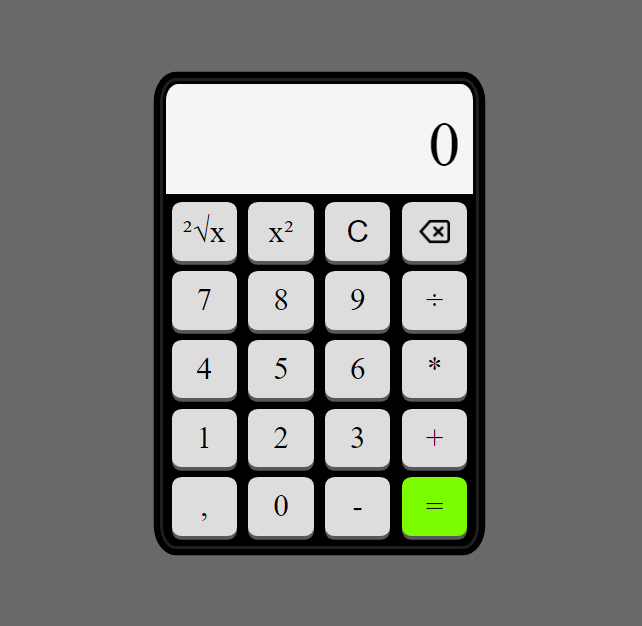

# Calculadora em JavaScript

`Esse projeto foi feito com HTML, CSS e JS.`

O principal foco do projeto é replicar a funcionalidade de uma calculadora em uma página web utilizando principalmente programação em JavaScript.